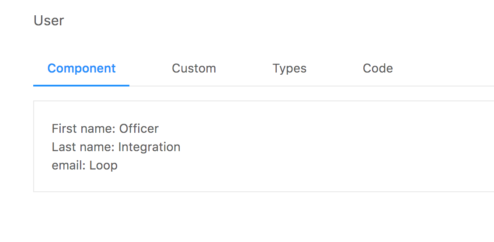

## Introduction ##
This project, and proof of concept, is a development environment for creating React components. It is inspired by both Storybook and Styleguidist, but differs with respect to a key design goal: developers shouldn't be burdened to write additional code (Storybook stories) or markdown (Styleguidist) when creating components. And especially not in the beginning of the development process. Fake data, based on types, should be autogenerated so that the developer can focus on the task at hand and only when types fail to provide sufficient information should she be required to do more.

## Features ##
The primary motivation for this project is to avoid creating fake data in the beginning of the development process. However, it doesn't take long before more specific data is required. Some examples include the following:
  - An actual name, rather than a randomly generated string of lorem ipsum.
  - A null value, rather than a number for a Maybe type of number.
  - An array of exactly 10 values, rather than an array of one or twenty values.

Styleguidist handles this by requiring the developer to write in data in .md files. Storybook has the developer write "stories". I've opted for another, possibly dubious solution: a GUI that allows the selection of more finely grained types where desired.
  - So if you want a name, you select an option from a dropdown menu, that generates a last name.
  - If you want a null value rather than a number (Maybe), press a button that toggles between the two.
  - If you want 10 array items, you type in a number.
  
I'm not at all convinced this strategy is better and care more about addressing the primary motivation noted above (even though the bulk of the work has been implementing this custom type selector). So at a minimum, I hope to see this project's core feature (autogenerated data) integrated into both Storybook and Styleguidist.

It also provides living documentation.

## Introductory Guide ##
Clone the repo and ```nvm use 8 && npm i && npm run cde```.

If you inspect `Post` in `src/components`, modify the type declaration and component as follows:

```
type Props = {
  firstName: string
  lastName: string,
  email: string
}

```

```
  <div className="User">
    <div>First name: {this.props.firstName}</div>
    <div>Last name: {this.props.lastName}</div>
    <div>email: {this.props.email}</div>
  </div>
```

Now navigate to the main screen. Data has been autogenerated for you.



Click on the `Types` tab and documention is also current with the code you just wrote. The data isn't particularly appropriate. So click on the `Custom` tab. On the dropdown marked `default`, select these options (or really, whatever you want):

```
firstName -> name - firstName
lastName -> name - lastName
email -> internet - email
```

Now click `New`. On the left hand side, a new snapshot has been created with the name `snapshot_1`. Click on it and then select the `Component` tab again. You should see data that more closely matches what you wanted.


Let's take a look at how snapshots work and Maybe values at the same time. First, delete snapshot_1 (currently, if you make changes to a type, it's possible that when selecting on an out-of-date snapshot an error may be thrown). Go back to the component's type declarations and edit it:

```
type Props = {
  user?: {
    firstName: string
    lastName: string,
    email: string
  }
}

...

class User extends Component<Props> {
  render() {
    const { user } = this.props;
    const display = user ? (
      <div className="User">
        <div>First name: {user.firstName}</div>
        <div>Last name: {user.lastName}</div>
        <div>email: {user.email}</div>
      </div>
    ) : (
      <div>Loading...</div>
    );

    return display;
  }
}

...

```

When you return to `Custom`, you'll now see the `Maybe` box is now capable of being toggled. Before toggling it, click `New` and select the new `snapshot_1`. In the input box that reads `snapshot_1`, change it to `loaded` and click `Edit`. Then check the `Maybe` box so it is unselected. Change the input box so it reads `loading` and then click `new`. Now when you inspect the components, you can examine both Maybe states.


Maybe types that aren't prop type keys work a little differently. Change the email value to a Maybe string and you can toggle it directly (rather than a checkbox).

```
type Props = {
  user?: {
    firstName: string
    lastName: string,
    email: ?string
  }
}

...
```


Finally, we'll end with unions. Mainly just to emphasize that a Union and Array of Unions behave differently.

```
type Props = {
  ...
  union: number | string | boolean,
  arrayOfUnion: Array<number | string | boolean>
}

...

```

A union must have one and only one option selected.


An array of a union must have at least one option selected.


## Supported Types ##
- [X] Number
- [X] String
- [X] Boolean
- Void
- [X] Literals (all literal values are currently coerced to strings - this will be fixed shortly)
- Function
- [X] Array
- [X] Object
- [X] Maybe
- Tuple
- [X] Union
- Generic
- Intersection
- Class
- Interface

## Upcoming Features ##
- Select the number of items in an array.
- Type in exact values (e.g., `true` and `false`).
- Disallow any type selection that doesn't satisfy Flow type.
- Disallow any type selection whose "ancestor type" is an unselected Maybe.
- Display warning when snapshot is out-of-date with current default; do not render such snapshots since they may throw an error.
- Allow merging of out-of-date snapshots to the current default snapshot.
  - New props must be added.
  - Deleted props must be deleted.
  - Modified props must be modified -- if an object, preserve as many of the selected custom types as possible.
- Allow components that render children to be displayed.
